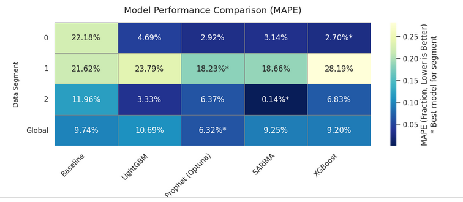
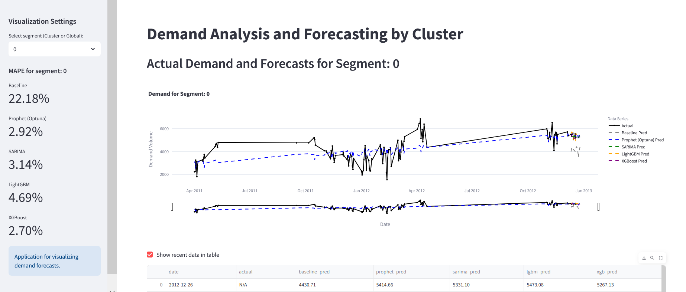
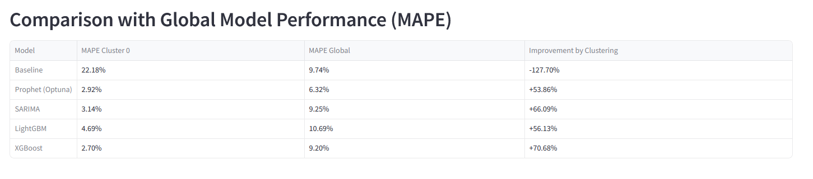

# Bike Share Demand Forecasting & Cluster-Based Modeling

This project focuses on forecasting daily bicycle rental demand for a bike-sharing system. A key aspect of this work is the investigation into whether a cluster-based modeling approach (segmenting data first, then training models per segment) yields superior prediction accuracy compared to a single, global forecasting model.

**Live Demo (via Streamlit):**
https://bikesharedemandproject-h7o9ftjx684krj6xbwiouw.streamlit.app/

## Table of Contents
1.  [Project Goal](#project-goal)
2.  [Business Value](#business-value)
3.  [Core Hypothesis](#core-hypothesis)
4.  [Dataset](#dataset)
5.  [Methodology](#methodology)
    *   [Data Preprocessing & Feature Engineering](#data-preprocessing--feature-engineering)
    *   [Clustering](#clustering)
    *   [Forecasting Models](#forecasting-models)
    *   [Evaluation Metric](#evaluation-metric)
6.  [Key Findings & Results](#key-findings--results)
    *   [Model Performance Comparison (Heatmap)](#model-performance-comparison-heatmap)
    *   [Cluster 0: Deep Dive & Global Comparison](#cluster-0-deep-dive--global-comparison)
    *   [Interactive Demand Analysis Dashboard Snippet](#interactive-demand-analysis-dashboard-snippet)
7.  [Challenges Faced](#challenges-faced)
8.  [Why This Project Was Interesting & Useful](#why-this-project-was-interesting--useful)
9.  [Technologies Used](#technologies-used)
10. [How to Run (Locally)](#how-to-run-locally)
11. [Future Work](#future-work)
12. [DEMO](#DEMO)

## Project Goal
The primary objectives were:
1.  To develop robust models for forecasting bicycle rental demand for the next 7 days.
2.  To rigorously test the hypothesis that pre-clustering the data (based on inherent patterns) and subsequently training specialized forecasting models on each cluster improves prediction accuracy compared to using a single global model.

## Business Value
Accurate bike share demand forecasting provides significant business advantages:
*   **Optimized Logistics:** Efficiently redistribute bikes to meet demand, minimizing instances of empty or overstocked stations.
*   **Cost Reduction:** Lower operational costs associated with unnecessary bike relocations.
*   **Enhanced Customer Satisfaction:** Ensure bikes are available when and where users need them.
*   **Increased Revenue:** Maximize rental opportunities by reducing missed rentals due to unavailability.
*   **Proactive Maintenance Planning:** Predict high-usage periods and plan bike maintenance accordingly.

## Core Hypothesis
The central hypothesis tested was:
> **Segmenting the bike-sharing demand data through clustering and then applying tailored forecasting models to each cluster leads to more accurate 7-day demand predictions compared to relying on a single global model trained on the entire dataset.**

This is based on the assumption that different underlying demand patterns (e.g., weekday vs. weekend, good weather vs. bad weather) exist, and specialized models can better capture these nuances.

## Dataset
The project utilizes a historical bike-sharing dataset  from Kaggle, typically containing features like:
*   Datetime stamps
*   Weather conditions (temperature, humidity, wind speed)
*   Day type (holiday, working day)
*   Seasonal information
*   Registered and casual user counts
*   Total rental count (target variable)

## Methodology

### Data Preprocessing & Feature Engineering
Standard preprocessing steps were applied, including handling missing values, outlier treatment, and feature engineering (e.g., extracting hour, day of week, month, year from datetime; creating lag features).

### Clustering
*   **Dimensionality Reduction:** Principal Component Analysis (PCA) was used to reduce the dimensionality of relevant features before clustering.
*   **Clustering Algorithm:** K-Means clustering was applied to the PCA-transformed data to segment the dataset into distinct clusters, each representing a different demand pattern profile. Three clusters (0, 1, 2) were identified.

### Forecasting Models
A suite of forecasting models was evaluated on both the global dataset and on each individual cluster:
*   **Baseline:** A simple persistence model (e.g., naive forecast).
*   **Statistical Models:** SARIMA (Seasonal Autoregressive Integrated Moving Average).
*   **Machine Learning Models:**
    *   LightGBM
    *   XGBoost
    *   Prophet (with Optuna for hyperparameter tuning)

### Evaluation Metric
Model performance was primarily assessed using the **Mean Absolute Percentage Error (MAPE)**, as it provides a relative measure of error that is easy to interpret.

## Key Findings & Results

The results strongly support the core hypothesis that a cluster-based modeling approach can significantly enhance forecasting accuracy.

### Model Performance Comparison (Heatmap)

*Figure 1: Model Performance Comparison (MAPE). This heatmap visualizes the MAPE for each model across different data segments (Clusters 0, 1, 2, and Global). Lower MAPE values (darker blue) indicate better performance. The asterisk (*) denotes the best performing model for that specific segment.*

**Key Observations from the Heatmap:**
*   **Clustering Efficacy:** Different models excel on different clusters, highlighting the diverse nature of demand patterns within each segment.
*   **SARIMA on Cluster 2:** Achieved an exceptionally low MAPE of 0.14%, indicating a very predictable and distinct pattern within this cluster.
*   **XGBoost on Cluster 0:** Performed best on Cluster 0 with a MAPE of 2.70%.
*   **Prophet (Optuna) on Cluster 1 & Global:** Was the top performer for Cluster 1 (18.23% MAPE) and the Global dataset (6.32% MAPE).
*   **No Single Best Model Globally:** The optimal model varies depending on the specific data segment, reinforcing the value of the clustering approach.

### Cluster 0: Deep Dive & Global Comparison

*Figure 2: Comparison of Model Performance (MAPE) on Cluster 0 vs. Global Data. This table specifically focuses on Cluster 0, comparing the MAPE of models trained only on Cluster 0 data against their counterparts trained on the entire global dataset. The "Improvement by Clustering" column shows the percentage gain in accuracy.*

**Key Observations from Cluster 0 Comparison:**
*   Models like Prophet (Optuna), SARIMA, LightGBM, and XGBoost showed **substantial improvements** (53% to 70% reduction in MAPE) when trained specifically on Cluster 0 data compared to their global model performance when predicting for data points belonging to Cluster 0.
*   This strongly indicates that tailoring models to the specific characteristics of Cluster 0 leads to far superior local predictions.

### Interactive Demand Analysis Dashboard Snippet

*Figure 3: Interactive Dashboard Snippet for Demand Analysis and Forecasting (Segment 0). This image shows a part of the Streamlit application, visualizing actual demand versus forecasts from different models for Cluster 0. The sidebar displays the MAPE scores for each model on this specific segment, with XGBoost (2.70%) and Prophet (Optuna) (2.92%) being the top performers.*

This interactive visualization (part of the Streamlit app) allows for dynamic exploration of model performance and forecasts across different segments.

## Challenges Faced
*   **Optimal Cluster Definition:** Determining the right features for clustering and the optimal number of clusters.
*   **Feature Engineering:** Crafting features that effectively capture temporal and weather-related dependencies.
*   **Model Selection & Tuning:** Experimenting with various models and tuning their hyperparameters (especially for Prophet with Optuna) was computationally intensive.
*   **Interpreting Cluster-Specific Behaviors:** Understanding why certain models performed better on specific clusters.

## Why This Project Was Interesting & Useful
*   **Practical Application:** Addresses a real-world problem with tangible business benefits.
*   **Methodological Exploration:** Provided an opportunity to compare a standard global modeling approach with a more nuanced cluster-based strategy.
*   **End-to-End Data Science:** Covered the full lifecycle from data preprocessing and EDA to modeling, evaluation, and even a basic deployment (Streamlit).
*   **Learning Advanced Techniques:** Gained experience with PCA, K-Means, various time-series and ML forecasting models, and hyperparameter optimization tools like Optuna.

## Technologies Used
*   **Programming Language:** Python
*   **Core Libraries:** Pandas, NumPy, Scikit-learn (for PCA, K-Means, metrics)
*   **Forecasting Models:** Statsmodels (SARIMA), Prophet, XGBoost, LightGBM
*   **Hyperparameter Optimization:** Optuna
*   **Visualization:** Matplotlib, Seaborn, Plotly (likely used in Streamlit)
*   **Web Application:** Streamlit
*   **Deployment (for demo):** ngrok (for tunneling the local Streamlit app)

## DEMO


## How to Run (Locally)

1.  **Clone the repository:**
    ```bash
    git clone https://github.com/orangegreen212/Bike_share_demand_project/
    cd  orangegreen212/Bike_share_demand_project
    ```
2.  **Create a virtual environment and install dependencies:**
    ```bash
    python -m venv venv
    source venv/bin/activate  # On Windows: venv\Scripts\activate
    pip install -r requirements.txt
    ```
3.  **Run the Jupyter Notebooks/Python scripts** for data processing and model training (provide specific instructions if you have multiple notebooks).
    ```bash
    jupyter notebook
    ```
4.  **To launch the Streamlit dashboard:**
    ```bash
    streamlit run app.py  # Or your main Streamlit script name
    ```

## Future Work
*   **Dynamic Re-clustering:** Implement a mechanism to periodically re-evaluate cluster assignments as new data arrives.
*   **Ensemble Modeling:** Explore ensemble techniques, potentially combining predictions from the best models for each cluster.
*   **Deeper Dive into Cluster 1:** Investigate why Cluster 1 had a relatively higher MAPE, perhaps by exploring different features or more complex models for this segment.
